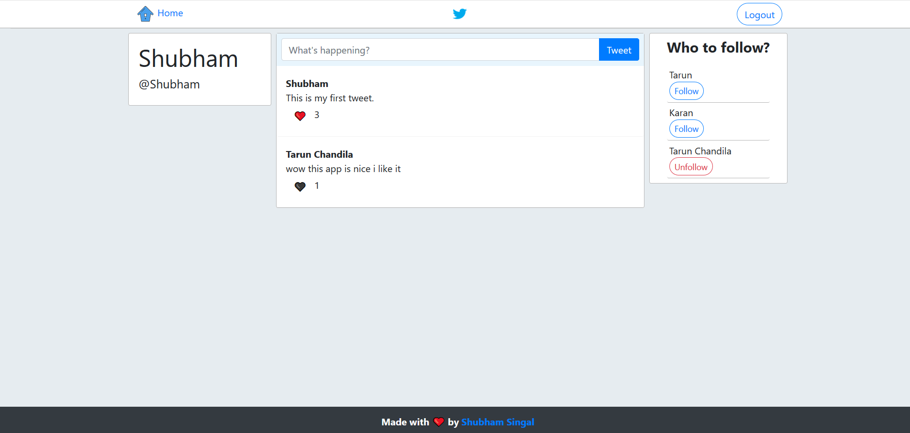

# Twitter Clone
As the name suggests it is the clone of twitter 
though it does not have all the features of the twitter
but it does have some basic features listed below

* User can add a tweet .
* User can follow or unfollow users .
* Can also like aur dislike a tweet though a tweet can only be disliked if it is already liked by that user.



---

## Backend 
Its backend is made on NodeJS . MongoDB is used for database . To run the backend server you need to have node and mongodb installed on your system and open Backend folder and perform the following steps.

```powershell
# Install dependencies
npm install

# Start mongodb server
## First create data folder in Backend  
mongod --dbpath=./data

# Start server on localhost:5000
npm start
```

---

## Frontend
Frontend is made on ReactJS and Bootstrap is used for css. To start app open Frontend folder and perform the following steps.

```powershell
# Install dependencies
npm install

# Serve on localhost:3000
npm start
```

# App Info
### Author 
Shubham Singal

---

### Version 
1.0.0

